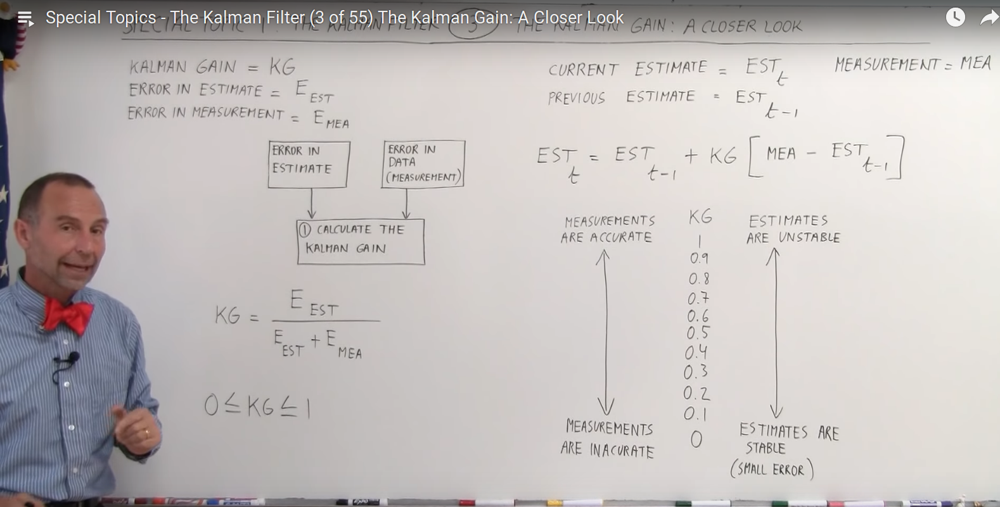
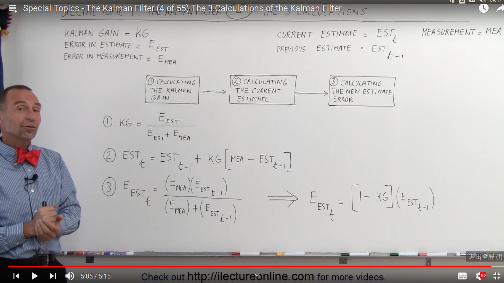
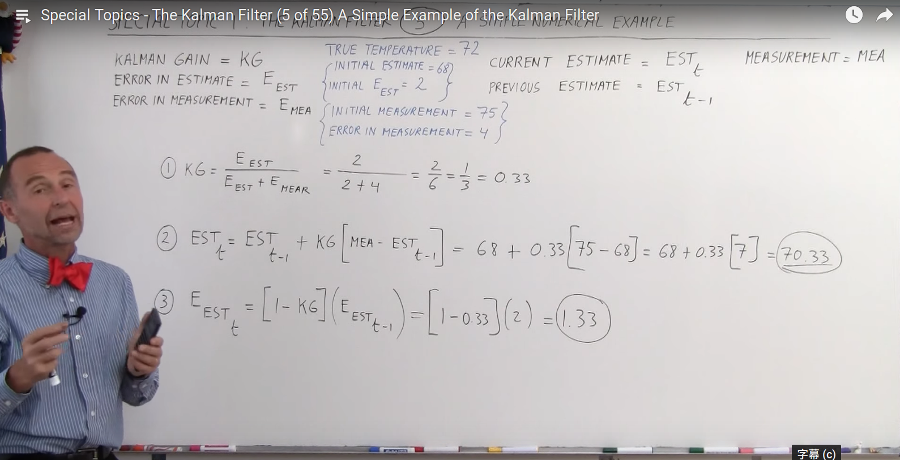
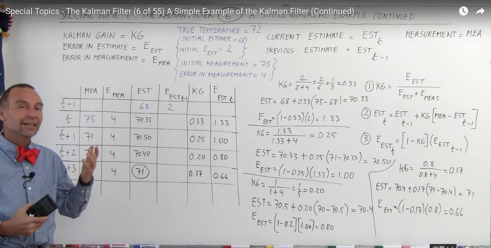
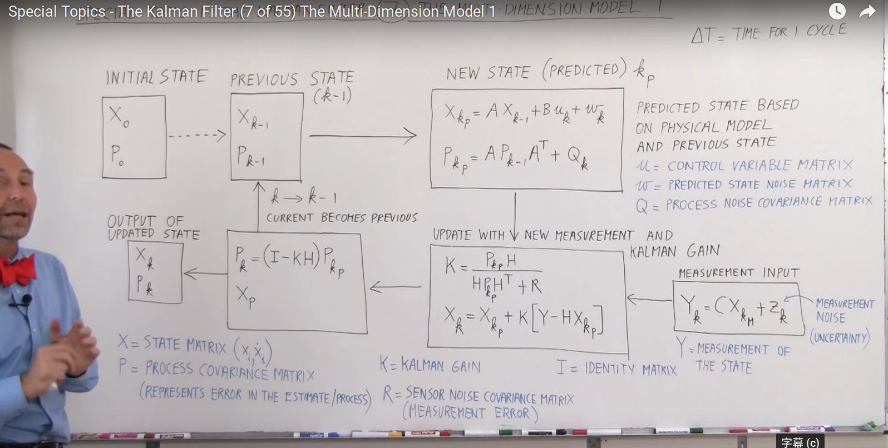
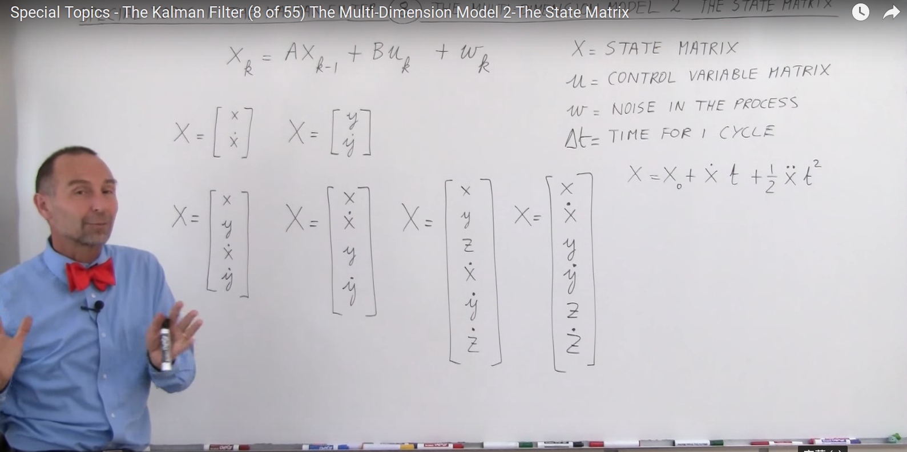
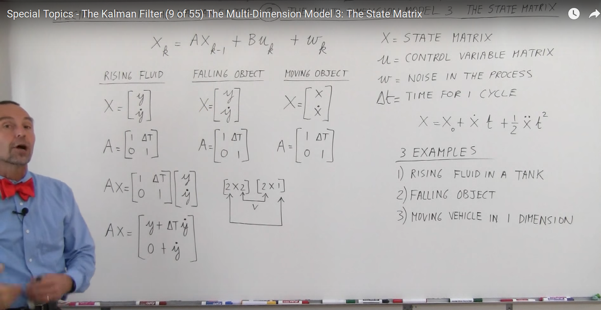

# Special Topics - The Kalman Filter

This is a study note of a youtube vedio course:[^SpecialTopics-KalmanFilter]

<iframe width="640" height="480" src="https://www.youtube.com/embed/u1QcZxWRYtg" frameborder="0" allow="accelerometer; autoplay; encrypted-media; gyroscope; picture-in-picture" allowfullscreen></iframe>

![02 Kalman Filter Architechture[^SpecialTopics-KalmanFilter] ](assets/markdown-img-paste-20190204115426591.png){#fig:}

# Understanding Kalman Filters

<iframe width="640" height="480" src="https://www.youtube.com/embed/mwn8xhgNpFY?list=PLn8PRpmsu08pzi6EMiYnR-076Mh-q3tWr" frameborder="0" allow="accelerometer; autoplay; encrypted-media; gyroscope; picture-in-picture" allowfullscreen></iframe>

# References-
- [徐亦达-Kalman Filter](https://www.youtube.com/watch?v=UVNeulkWWUM&list=PLFze15KrfxbHCd0cF5D7FMfPD-B8pxmdN)
- [Special Topics - The Kalman Filter (1 of 55) What is a Kalman Filter?](https://www.youtube.com/watch?v=CaCcOwJPytQ&list=PLX2gX-ftPVXU3oUFNATxGXY90AULiqnWT)
- [Youtube-Understanding Kalman Filters](https://www.youtube.com/watch?v=mwn8xhgNpFY&list=PLn8PRpmsu08pzi6EMiYnR-076Mh-q3tWr)
- Bishop, Gary, and Greg Welch. "An introduction to the Kalman filter." Proc of SIGGRAPH, Course 8.27599-3175 (2001): 59.
- Brown, Robert Grover, and Patrick YC Hwang. Introduction to random signals and applied Kalman filtering. Vol. 3. New York: Wiley, 1992.

[^SpecialTopics-KalmanFilter]:https://www.youtube.com/watch?v=CaCcOwJPytQ&list=PLX2gX-ftPVXU3oUFNATxGXY90AULiqnWT
