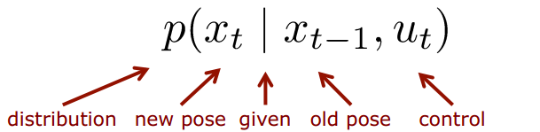

# Resources

- [Robot Mapping - WS 2013/14](http://ais.informatik.uni-freiburg.de/teaching/ws13/mapping/)

# Introduction to Robot Mapping
## What is SLAM?
- Computing the robot's poses and the map of the environment at the same time

- **Localization**: estimating the robot's location

- **SLAM**: building a map and localizing the robot simultaneously
  - What the environment looks like?
  - where the robot actually is?

Estimate the robot’s poses given landmarks

Estimate the landmarks given the robot’s poses

Estimate the robot’s poses and the landmarks at the same time

**The SLAM Problem:**
- SLAM is a chicken-or-egg problem:
  - a map is needed for localization and
  - a pose estimate is needed for mapping

It's a kind of a joint estimation task. We cannot fully decouple localization from mapping we actually have to solve this at the same point in time.

**SLAM is Relevant**:
- It is considered a fundamental problem for truly autonomous robots
- SLAM is the basis for most navigation systems

**SLAM Applications**:

SLAM is central to a range of indoor, outdoor, air and underwater applications for both manned and autonomous vehicles.

Examples:
  - At home: vacuum cleaner, lawn mower
  - Air: surveillance with unmanned air vehicles
  - Underwater: reef monitoring, catcombs
  - Underground: exploration of mines
  - Space: terrain mapping for localization

**iRobot (Youtube Demo)**:

<iframe width="640" height="383" src="https://www.youtube.com/embed/tZ0bq-jIg-o" frameborder="0" allow="accelerometer; autoplay; encrypted-media; gyroscope; picture-in-picture" allowfullscreen></iframe>

## **Definition of the SLAM Problem**

**Given**

- The robot􏰀s controls
  $$
  u_{1:T} = \{u_1, u_2, u_3 ..., u_T\}
  $$

- Observations

  $$
  z_{1:T} = \{z_1, z_2, z_3..., z_T\}
  $$

**Wanted**

- Map of the environment
  $m$
- Path of the robot
  $$
  x_{0:T} = \{x_0, x_1, x_2..., x_T \}
  $$

**Probabilistic Approaches**
- Uncertainty in the robot’s motions and observations
- Use the probability theory to explicitly represent the uncertainty

**In the Probabilistic World**

Estimate the robot’s path and the map

$$
p(x_{0:T}, m | z_{1:T}, u_{1:T})
$$

The whole thing we're going to do in this course is just how can we actually estimate that probability distribution.

**Graphical Model**

## Full SLAM vs. Online SLAM

- Full SLAM estimates the entire path
$$
p(x_{0:T}, m | z_{1:T}, u_{1:T})
$$

- Online SLAM seeks to recover only the
most recent pose

$$
p(x_t, m | z_{1:t}, u_{1:t})
$$

I just want to estimate the current pose of the robot and the map build up to the current point in time that's wahat's written here has a small $t$ so it's not necessarily the whole sequence or small $t$ is within 0 and large $T$.

## Online SLAM

- Online SLAM means marginalizing out the previous poses
$$
p(x_{t}, m | z_{1:t}, u_{1:t}) = \\
\int_{x_0} ... \int_{x_{t-1}} p(x_{0:t}, m|z_{1:t}, u_{1:t})dx_{t-1}... dx_0
$$

P of A is the integral over all B's of P of A and B db, and what is remains if I integrate about all possible outcomes that B can take and end up having the probability distribution body.

$$
P(A) = \int_B P(A, B)dB
$$

- Integrals are typically solved recursively, one at at time

## Graphical Model of Online SLAM

{#fig:}

$$
p(x_{t+1}, m | z_{1:t+1}, u_{1:t+1}) = \\
\int_{x_0} ... \int_{x_{t}} p(x_{0:t+1}, m|z_{1:t+1}, u_{1:t+1})dx_{t}... dx_0
$$

## Why is SLAM a Hard Problem?
1. Robot path and map are both unknown

2. Map and pose estimates correlated
3. The mapping between observations and the map is unknown
1. Picking wrong data associations can have catastrophic consequences (divergence)

## Taxonomy of the SLAM Problem
- Volumetric vs. feature-based SLAM
- Topologic vs. geometric maps
- Known vs. unknown correspondence
- Static vs. dynamic environments
- Small vs. large uncertainty
- Active vs. passive SLAM
- Any-time and any-space SLAM
- Single-robot vs. multi-robot SLAM

## Three Main Paradigms
- Kalman filter
- Particle filter
- Graph based

## Motion and Observation Model

The motion model tells me how that the robot move and the observation models how should I interpret my observation.

The observation model it says what's the likelihood of an observation given I know where the robot is and given I know what the world looks like.

## Motion Model
The motion model describes the relative motion of the robot

## Motion Model Example

## Standard Odometry Model

- Robot moves from $(\bar x, \bar y, \bar \theta)$ to $(\bar x', \bar y', \bar \theta')$
- Odometry information $u=(\delta_{rot1}, \delta_{trans}, \delta_{rot2})$

$$
\delta_{trans} = \sqrt{ (\bar x'-\bar x)^2 + (\bar y' - \bar y)^2 }\\
\delta_{rot1} = atan2(\bar y'-\bar y, \bar x' - \bar x) - \bar \theta  \\
\delta_{rot2} = \bar \theta' - \bar \theta - \delta_{rot1}
$$

## Observation Model

- The observation or sensor model relates measurements with the robot’s pose

References

- [Robot Mapping - WS 2013/14](http://ais.informatik.uni-freiburg.de/teaching/ws13/mapping/)
